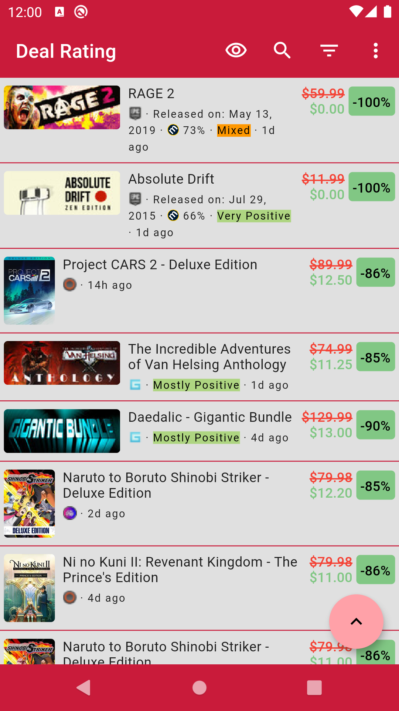
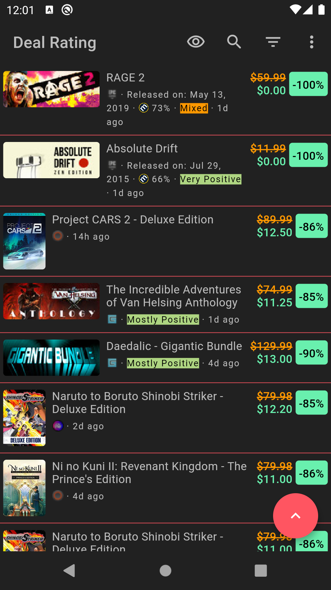
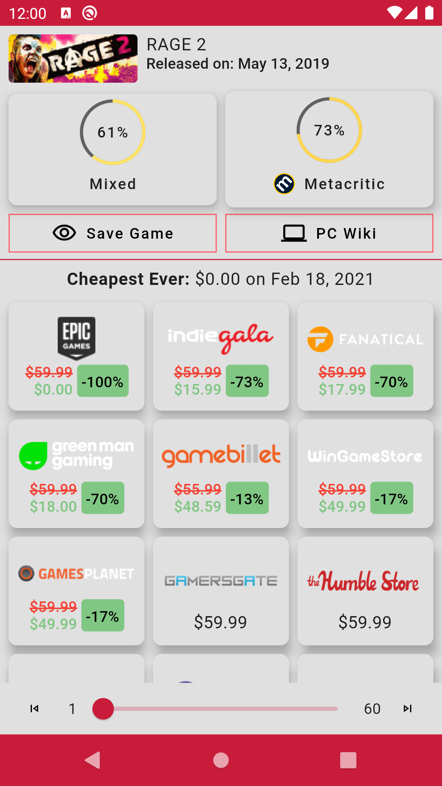
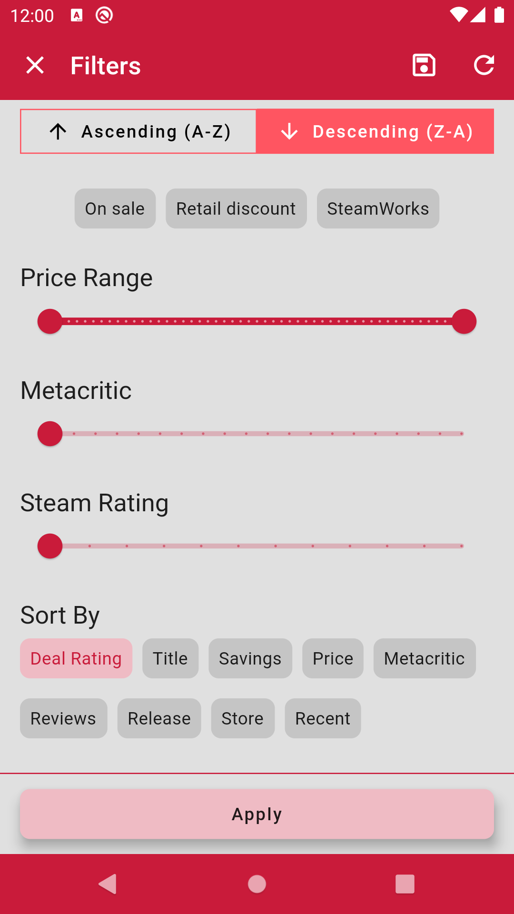
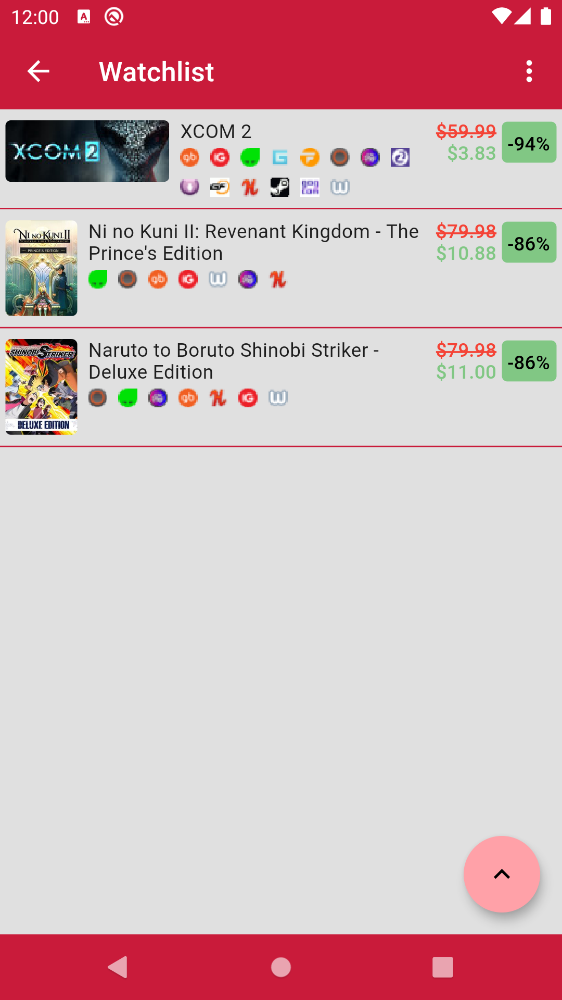
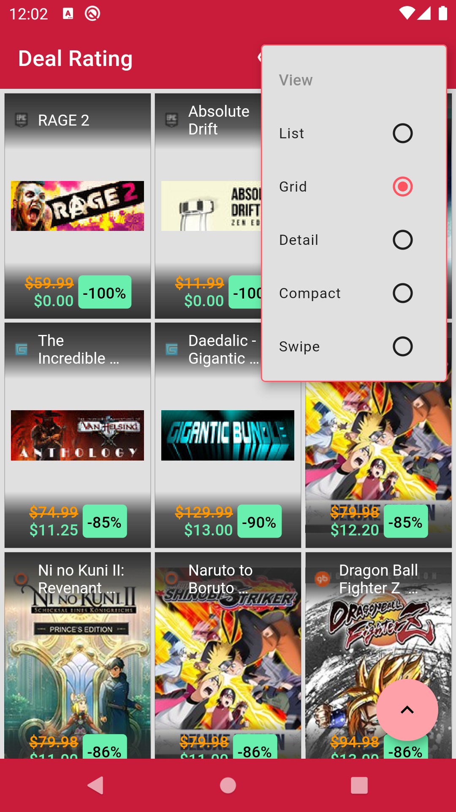
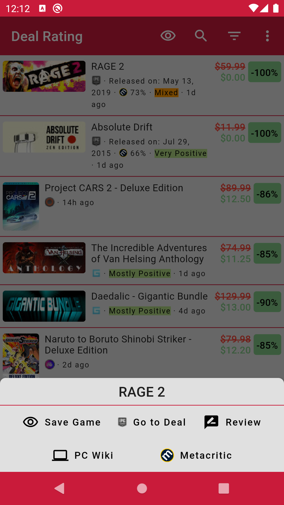

# Gameshop Deals 

**Or you can [donate on PayPal](https://paypal.me/EdwynZN)**

Browse through different shops and find the best deals of the games you want!

Features:
- Infinite scrolling, as long as there are deals, they will be fetched, the sky is the limit
- Filter by:
    - **Ascending** and **Descending** order
    - **SteamWorks** (games that are registered in steam, regardless the store), **Retail Discount** (games with a retail price **< $29**) and **On Sale** only
    - **Deal Rating** (from 0 to 10, factors reviews, price, saving etc.), **Title**, **Savings**, **Price**, **Metacritic**, **Reviews**, **Release** (release date of the game), **Store** and **Recent** (How recent a deal was found by CheapShark, not confuse with release date)
    - Metacritic Score, Price Range or Steam Rating
    - Search across multiple stores or select only the one you want
- Create a custom filter and save it to start the app with it always, useful if you're only interested in particular stores or deals
- Light and Dark Theme
- Multiple views:
    - **List**, **Compact**, **Grid** and **Detail** to show the deals arranged in the screen
        - Tap to visualize a page with all the information related with that deal
        - Long Press to select what you want to do with that deal:
            - Metacritic page (if available)
            - PCWiki (if available)
            - Steam reviews (if available)
            - Go to the deal website
            - Save the game in your personal list (notifications coming soon)
    - **Swipe** to see all the information related of an specific deal in a page, including visualization of the same deal in multiple stores to compare prices
- Search by name, with filter availability specific to that search, so each search can be unique

##### [Powered by CheapShark](https://www.cheapshark.com/)

## Screenshots

  
  
  

## Getting Started

This project is a starting point for a Flutter application.

A few resources to get you started if this is your first Flutter project:

- [Lab: Write your first Flutter app](https://flutter.dev/docs/get-started/codelab)
- [Cookbook: Useful Flutter samples](https://flutter.dev/docs/cookbook)

For help getting started with Flutter, view our
[online documentation](https://flutter.dev/docs), which offers tutorials,
samples, guidance on mobile development, and a full API reference.
